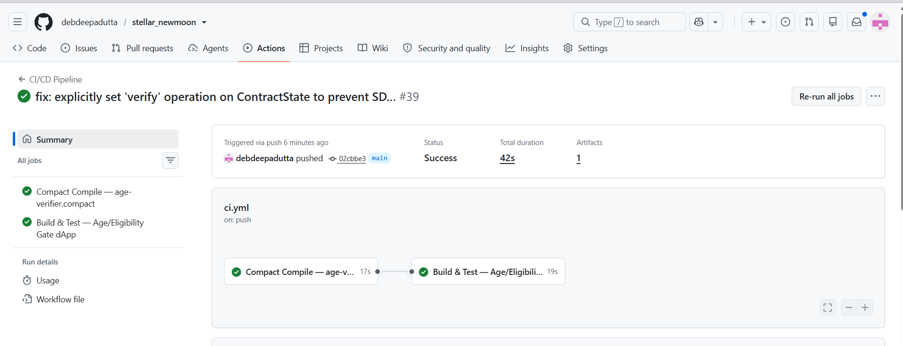
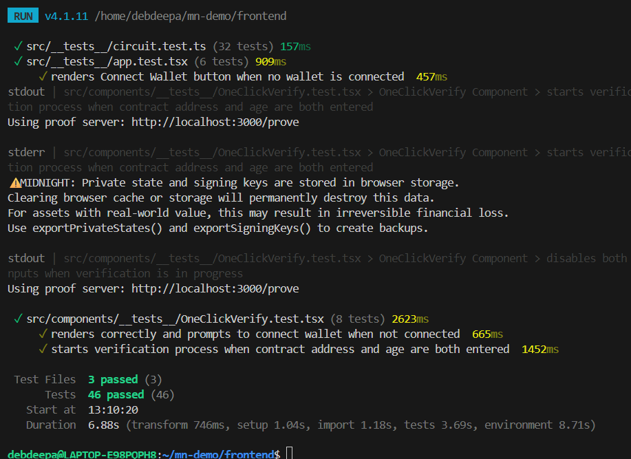

# Midnight Age Verifier
> A privacy-preserving zero-knowledge dApp that proves you meet an age requirement without revealing your actual age — with independent, per-user verification, revocation, and status lookup.

[](https://github.com/debdeepadutta/stellar_newmoon/actions/workflows/ci.yml)

## Level 3 Submission Requirements

### Product Idea Proposal
- **File:** [`PROPOSAL.md`](./PROPOSAL.md) — product idea submission describing the privacy model, circuit design, and ZK proof flow.

### CI/CD Pipeline
- **Status:** Passing ✅
- **Workflow File:** `.github/workflows/ci.yml`
- **Actions Badge:** See the badge above



### Automated Tests
- **Tests Passing:** 46 tests across 3 files
- **Coverage:** UI state, wallet connection, default values, multi-circuit ZK verification guards, **per-user circuit-logic assertions**, and **ledger-state-transition verification**



### Demo Video
[▶ Watch the Live Demo Recording](PASTE_YOUR_NEW_VIDEO_LINK_HERE)
> Re-recorded to show the full multi-circuit flow: deploy → verify → revoke → check status, across two independent users.

### Privacy Model
See the **Privacy Model** section below for a detailed breakdown of what an observer can and cannot learn.

---

## Level 2 Submission Requirements

### Live Demo (Vercel)
[https://stellar-newmoon-zn9z.vercel.app](https://stellar-newmoon-zn9z.vercel.app)

### Approved Idea: Age / Eligibility Gate
> *Prove a threshold without revealing the underlying value.*

This dApp proves that a user meets a minimum age requirement using a **Zero-Knowledge Proof** on the Midnight network. The user's exact age is **never** transmitted to any server, stored on any ledger, or visible to any observer — only a cryptographic proof that `age >= minimumAge` is submitted to the blockchain, tracked independently per user.

---

## Contract Design

The contract is a small multi-circuit system with real lifecycle logic, not a single one-shot check:

| Circuit | Type | Purpose |
|---|---|---|
| `constructor(threshold)` | Deploy-time | Sets the minimum age threshold. Rejects thresholds below 18 (`assert(threshold >= 18)`). |
| `verify(myAge, userId)` | State-changing | Privately checks `0 < myAge < 150` and `myAge >= minimumAge`, then sets `verifications[userId] = true`. Each user's result is stored independently in a map — one user verifying never affects another. |
| `revokeVerification(userId)` | State-changing | Lets a user revoke their own prior verification, setting `verifications[userId] = false`. Models real-world lifecycle change (e.g. withdrawing consent). |
| `isVerified(userId)` | Read-only | Anyone can check a user's current public verification status without needing any private input. |

### Smart Contract Integration
The dApp generates zero-knowledge proofs locally in the browser using the `age-verifier.compact` circuit. The threshold is set once when the contract is deployed. Then, any user can connect to the contract and call the `verify` circuit, providing their private age to generate a proof that they meet the threshold — and later `revokeVerification` if they choose, with status checkable anytime via `isVerified`.

---

## Privacy Model

### What an observer CAN learn
| Observable | Value |
|---|---|
| A contract deployment transaction occurred | ✅ Yes — visible on-chain |
| The minimum age threshold enforced | ✅ Yes — `minimumAge` (≥ 18) is stored in the public ledger state |
| Whether a specific user is currently verified | ✅ Yes — `verifications[userId]` is a public map entry |
| A user's identity commitment (`userId`) | ✅ Yes — used as a public map key; this is a self-chosen commitment, not a real-world identity |
| The contract address | ✅ Yes — public |
| The wallet address that deployed | ✅ Yes — public |

### What an observer CANNOT learn
| Hidden | Why |
|---|---|
| The user's actual age | ❌ Never stored anywhere — kept entirely in the user's browser, and supplied privately to the `verify` circuit on every call |
| Whether the user is 18, 25, or 99 | ❌ The ZK proof reveals only that `minimumAge <= age < 150` holds |
| Any biometric or identity data | ❌ No such data is ever collected; `userId` is a self-chosen commitment, not tied to any real identity |
| The exact numeric value passed to the circuit | ❌ The prover runs locally; inputs stay private |

### How it works (ZK proof flow)
1. The contract is deployed with a minimum age threshold (must be ≥ 18).
2. A user types their age locally in the browser — **it never leaves their device**.
3. The Midnight ZK circuit (`verify`) runs a local proof: `assert(0 < myAge < 150)` and `assert(myAge >= minimumAge)`.
4. A **cryptographic proof** (not the age itself) is generated by the local proof server.
5. The proof is submitted to the Midnight blockchain, updating only that user's entry: `verifications[userId] = true`.
6. Any observer can verify the proof is valid and check the verification status via the read-only `isVerified` circuit, but **cannot reverse-engineer the user's age**.
7. A user can call `revokeVerification` at any time to set their own status back to `false`.

---

## Contract Address
| Network  | Address |
|----------|---------|
| Preprod  | *(redeploy after latest circuit changes and update this row)* |
| Preview  | *(redeploy after latest circuit changes and update this row)* |

> ⚠️ The addresses previously listed here pointed to the earlier single-flag version of the contract and will not work with this frontend. Deploy the latest `age-verifier.compact` and paste the new addresses in before submitting.

---

## Tech Stack
| Layer | Technology |
|---|---|
| Smart Contract | Compact (Midnight's ZK language) |
| ZK Proving | Midnight.js SDK + local Docker proof server |
| Frontend | React + Vite + TypeScript |
| Wallet | 1AM / Lace (Midnight DApp Connector API) |
| Deployment | Vercel |
| CI/CD | GitHub Actions |
| Testing | Vitest + React Testing Library |

---

## Tests & CI/CD

This project includes **46 automated tests** across 3 test files covering:
- UI state and navigation (Verify, Revoke, Check Status tabs)
- Wallet connection state and button disabled/enabled states during proof generation
- ZK verification flow guards (preventing underage and out-of-range inputs)
- **Circuit-logic assertions** — range validation (`0 < myAge < 150`), threshold enforcement, and per-user isolation (User A's verification never overwrites User B's)
- **Ledger-state-transition tests** — `minimumAge` bounds at deploy, `verifications` map updates on verify/revoke, and `isVerified` read-only consistency

**Run tests locally:**
```bash
cd frontend
npm run test
```

**CI/CD Pipeline** (`.github/workflows/ci.yml`) runs on every push to `main`:
1. ✅ TypeScript typecheck (`tsc --noEmit`)
2. ✅ **Compact compile** — validates `age-verifier.compact` circuit compiles cleanly
3. ✅ Run all 46 tests (`vitest run`)
4. ✅ Build production bundle (`vite build`)
5. ✅ Upload build artifact to GitHub Actions

---

## Prerequisites
- [1AM Wallet](https://1am.finance) or Lace wallet browser extension installed
- Node.js v22+
- Docker Desktop (for local proof server)

---

## Run Locally

1. **Clone the repository**
   ```bash
   git clone https://github.com/debdeepadutta/stellar_newmoon.git
   cd stellar_newmoon
   ```

2. **Start the Midnight proof server (Docker)**
   ```bash
   npm run proof-server:start
   ```

3. **Install and run the frontend**
   ```bash
   cd frontend
   npm install
   npm run dev
   ```
   Open `http://localhost:5173` in your browser.

4. **Deploy a contract** with a minimum age threshold (≥ 18), then **connect your wallet, enter your age, and verify**. Try revoking and checking status afterward to see the full lifecycle.

---

## Project Structure
```
mn-demo/
├── contracts/
│   └── age-verifier.compact        # ZK smart contract: verify / revokeVerification / isVerified
├── frontend/
│   ├── public/
│   │   ├── *.bzkir / *.prover      # Compiled ZK circuit keys
│   └── src/
│       ├── components/
│       │   ├── DeployContract.tsx  # Deploys a new contract instance with a threshold
│       │   └── OneClickVerify.tsx  # Verify / Revoke / Check Status UI
│       ├── context/
│       │   └── WalletContext.tsx   # Wallet state management
│       └── __tests__/
│           ├── circuit.test.ts     # Circuit-logic and ledger-state tests
│           └── app.test.tsx        # Frontend tests
└── .github/workflows/ci.yml       # CI/CD pipeline
```
